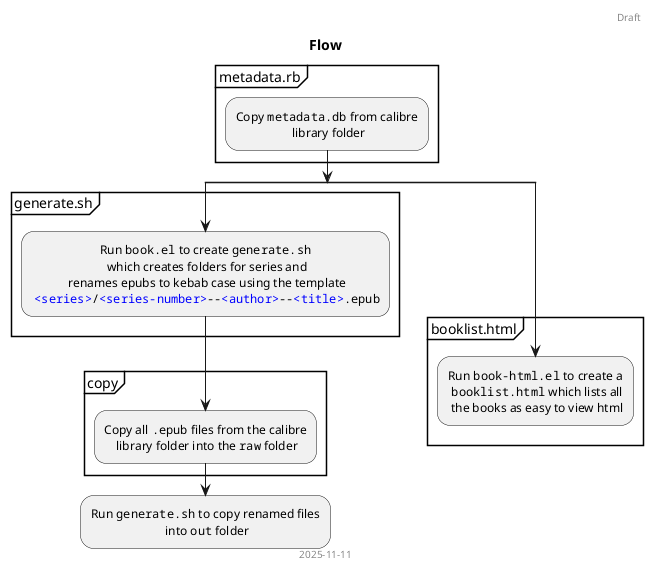

# Calibre Utils #

Utility scripts to work with a calibre library for

1. Copy books grouped by series
2. Export html view of the library




## Copy books grouped by series ##

Calibre stores books in the following directory structure

```
<author>/<title> (<book-id>)/<title> - <author>.epub
```

where the author name & title are in title-case with spaces. Instead I want to easily navigate to series and prefer kebab-cased names. So, the directory structure uses

```
<series>/<series-index>--<author>--<title>.epub
```

This is achieved by copying the sqlite database used by calibre and extracting the metadata out of it. The relevant schema is given below


## Export html view of the library ##

Calibre has the calibre server which can serve up the library as a website but, I find it easier to scan through the books as csv/html. The export contains the following columns

| Column | Description |
|----|----|
| Book ID | Unique book identifer |
| Author | Book authors separated by '&' |
| Title | Book title |
| Series | Series name the book belongs to |
| Series Number | Order of the book in the given series |
